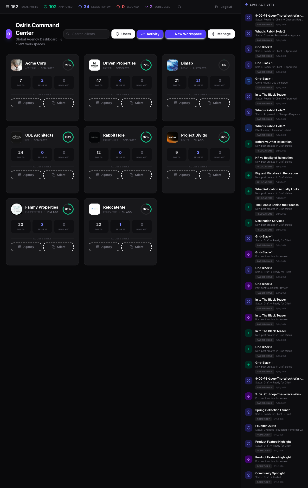
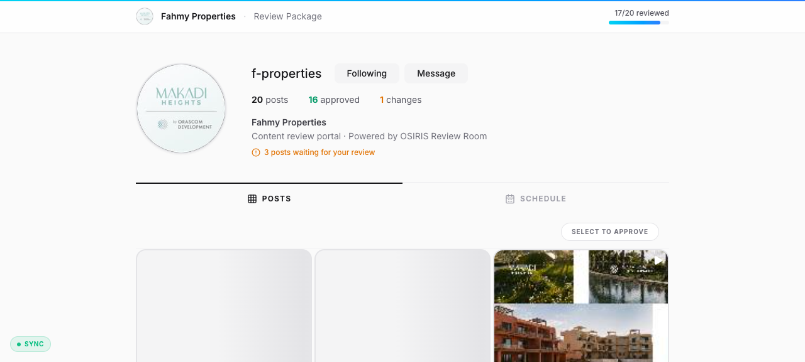
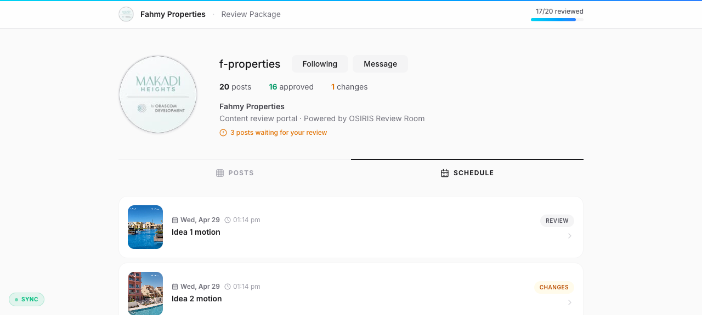

# OSIRIS Review Room

**Built by [OSIRIS LABS](https://theosirislabs.com)** — the anti-agency. We build systems, not campaigns.

A real-time social media content review engine purpose-built for agencies who manage multiple clients. No more WhatsApp threads, no more "which version is this," no more screenshots of screenshots.

Agencies create. Clients approve. Both see the same thing at the same time.


*The command center — every client, their progress, and what's happening right now*


*A full content grid where clients browse, pick, and approve*


*Scheduled posts — what's going out, when, and what's been signed off*

---

## What it does

**Command Center** — See all your clients at a glance. Who's at 80% approval. Who has 21 posts stuck in review. What changed five minutes ago.

**Agency View** — Full production cockpit. Post grid, status management, internal notes, bulk upload, campaign tracking. The messy side of content creation.

**Client View** — Clean, simple, Instagram-like. Clients see their content, approve what they like, request changes on what they don't. No noise, no confusion.

**Schedule** — What's going live, when, and whether the client has signed off. Calendar view with real-time status badges.

**Real-time sync** — A client approves something? The agency sees it instantly. Socket.io keeps both sides in lockstep.

**Multi-tenant by design** — Every client gets their own isolated workspace with a unique secure access token. No data cross-contamination.

**Your brand, not ours** — Upload your logo. It replaces ours everywhere — dashboard, share links, client portal.

**Theme-aware** — Dark mode for late nights. Light mode for client meetings. Your preference sticks.

**Categorized feedback** — When a client requests changes, they tag it as Content, Design, Concept, or Other. The agency knows exactly what to fix.

---

## Made for agencies

We built this because we ran one. The Review Room is what we use internally — and what our clients log into every day.

It's not a SaaS upsell. It's not a startup pitch. It's a tool we built to solve a real problem, and it's open source so anyone can do the same.

---

## Tech stack

| Layer | Stack |
|---|---|
| Frontend | React 19 + TailwindCSS v4 + Framer Motion |
| Backend | Express + Socket.io |
| Database | SQLite (better-sqlite3) |
| Language | TypeScript |
| Auth | Token-based per workspace |

---

## Run it locally

```bash
npm install
npm run dev
```

First run auto-seeds demo data with three workspaces and a super-admin account.

**Demo login:** `admin@reviewroom.local` / `demo2026`

Open `http://localhost:3000`

---

## Production deployment

```bash
docker build -t osiris-review-room:latest .
docker-compose up -d
```

The application runs behind Traefik with automatic HTTPS via Let's Encrypt. A `data/` volume mounts the SQLite database and uploaded media, so container restarts are zero-risk.

---

## Screenshots

| View | What you'll see |
|---|---|
| [Command Center](screenshots/command-center.png) | Agency dashboard with 8 client workspaces, progress tracking, live activity feed |
| [Client Posts](screenshots/client-posts.png) | Full-page content grid with approve/change/review workflow |
| [Client Schedule](screenshots/client-schedule.png) | Schedule view with 20 posts, statuses, dates |
| [Agency View](screenshots/agency-view.png) | Production cockpit with filters, bulk upload, campaign tracking |
| [Client Portal](screenshots/client-view.png) | Clean approval interface showing 17/20 reviewed |

---

**OSIRIS LABS** — [theosirislabs.com](https://theosirislabs.com) · [activeclients.theosirislabs.com](https://activeclients.theosirislabs.com)

*Anti-Agent · Systems · AI · MENA*
