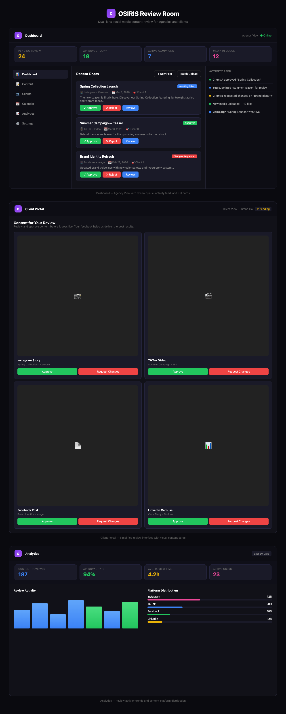

# OSIRIS Review Room

A dual-lens social media content review engine for agencies and clients. Built with React, Vite, Express, Socket.io, and SQLite.


*Dashboard — Agency view with KPI cards, review queue, and activity feed*


*Client Portal — Simplified review interface for clients*

## Features

- **Dual-Lens Architecture** — Agency and client views for streamlined content approval
- **Real-Time Updates** — Socket.io-powered live activity feed and instant status changes
- **Multi-Platform Content** — Manage posts for Instagram, TikTok, Facebook, LinkedIn and more
- **Campaign Management** — Organize content by campaign, client, and platform
- **Batch Upload & Processing** — Upload and process multiple media files simultaneously
- **Review Workflow** — Approve, reject, or request changes with one click
- **Client Portal** — Simplified interface for clients to review and approve content
- **Analytics Dashboard** — Track review activity, approval rates, and platform distribution
- **Team Management** — Manage users, roles, and permissions across tenants
- **Calendar View** — Plan and visualize content schedules

## Architecture

- **Frontend:** React 19 + TailwindCSS v4 + Framer Motion
- **Backend:** Express + Socket.io (real-time updates)
- **Database:** SQLite via better-sqlite3
- **Server:** TypeScript via tsx

## Running Locally

**Prerequisites:** Node.js 20+

1. Install dependencies:
   ```bash
   npm install
   ```

2. Run in development mode:
   ```bash
   npm run dev
   ```

3. Open `http://localhost:3000`

## Production Deployment & Security

The application now uses a secure tokenized authentication model for multi-tenant access.

```bash
# Build the Docker image
docker build -t osiris-review-room:latest .

# Run via docker-compose
docker-compose up -d --force-recreate
```

Deployed at: `https://review-room.theosirislabs.com`

### Large Video Uploads

If uploads fail at ~12% with a network error, the domain is likely behind **Cloudflare**, which has a 100-second timeout on free plans. Options:

1. **Bypass Cloudflare for uploads:** Create a DNS-only (grey cloud) subdomain, e.g. `upload-review-room.theosirislabs.com`, pointing to the same server. Use that subdomain for the app when uploading large files.
2. **Upgrade Cloudflare:** Enterprise plans support longer timeouts.
3. **Traefik timeouts:** The deployment includes extended Traefik timeouts (30 min) for the review-room service. Ensure the `upload-transports.yml` and `longUploadTransport` are loaded by Traefik.

### Access Control

When the container builds and starts, it automatically provisions random secure tokens for any new tenants. These tokens are required to access their respective views. 

**Getting your initial access URL:**
You can retrieve the secure login links by checking the docker logs:
```bash
docker logs --tail 200 review-room-app | grep "Copy Internal Link"
```

Once logged into the **Internal View**, you can click the **"Copy Link"** button in the bottom right corner to generate the secure invite link for the Client.

## Features

- **Internal View** — Agency-side production cockpit with post grid, status management, task checklists, internal notes, and asset lineage tracking. Access is strictly blocked without valid `token=` URL parameter.
- **Client View** — Clean Instagram-like review interface for clients to approve or request changes. Cannot view internal task notes. Access is explicitly secured via their dedicated token.
- **Real-time sync** — Socket.io keeps both views in sync instantly
- **Multi-Tenant Routing** — Fully isolated workspaces accessed via `?tenant=<id>&mode=<internal|client>&token=<secure_token>`.
- **Persistent storage** — SQLite database with automatic seeding
